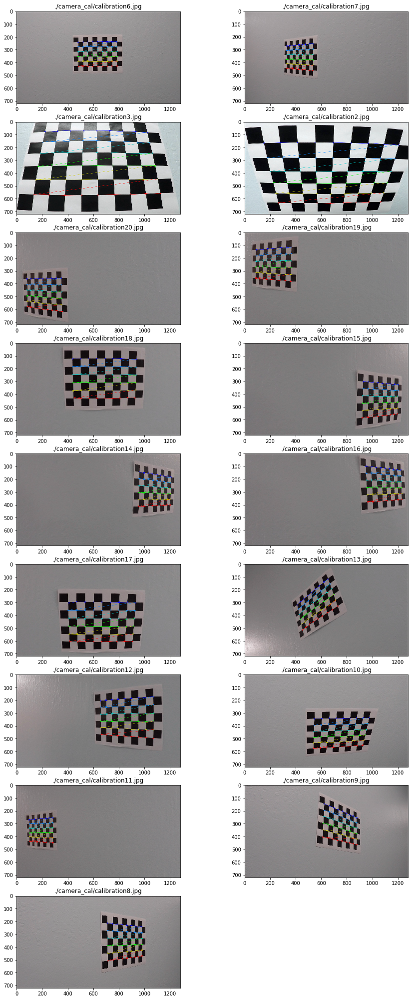
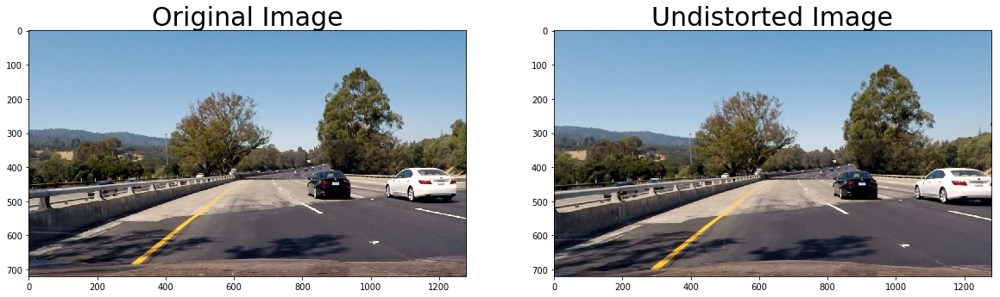
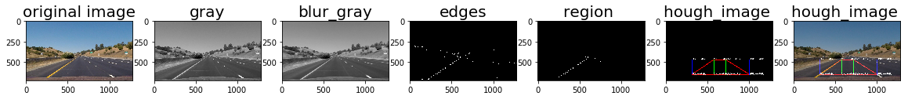
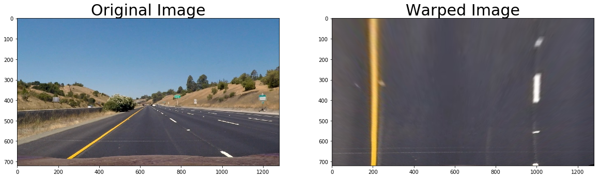
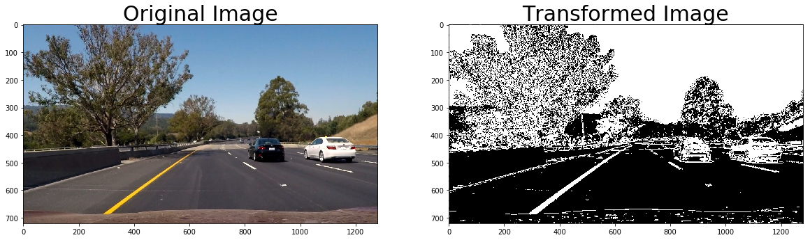
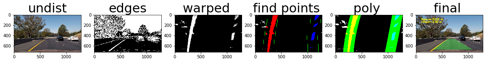

## Advanced Lane Lines Detection
---

**Advanced Lane Finding Project**

The goals / steps of this project are the following:

* Compute the camera calibration matrix and distortion coefficients given a set of chessboard images (Done)
* Apply a distortion correction to raw images (Done)
* Use color transforms, gradients, etc., to create a thresholded binary image.(color filter applied) (Done)
* Apply a perspective transform to rectify binary image ("birds-eye view").(Done)
* Detect lane pixels and fit to find the lane boundary. (Done)
* Determine the curvature of the lane and vehicle position with respect to center.(Curvature is very big!!!)
* Warp the detected lane boundaries back onto the original image.(Done)
* Output visual display of the lane boundaries and numerical estimation of lane curvature and vehicle position.(lane curvature should be estimated)

[//]: # (Image References)

[image1]: ./examples/undistort_output.png "Undistorted"
[image2]: ./test_images/test1.jpg "Road Transformed"
[image3]: ./examples/binary_combo_example.jpg "Binary Example"
[image4]: ./examples/warped_straight_lines.jpg "Warp Example"
[image5]: ./examples/color_fit_lines.jpg "Fit Visual"
[image6]: ./examples/example_output.jpg "Output"
[video1]: ./project_video.mp4 "Video"

## [Rubric](https://review.udacity.com/#!/rubrics/571/view) Points

### Here I will consider the rubric points individually and describe how I addressed each point in my implementation.  

### Camera Calibration

#### 1. Briefly state how you computed the camera matrix and distortion coefficients. Provide an example of a distortion corrected calibration image( TODO)

The code for this step is contained in the section **"Step1. Pipeline for distortion elimination"** of the IPython notebook located in the root directory  **"./P2_Advanced_LL_Detection.ipynb"**.
The methods for the camera calibration are located in Distortion.py library

I start by preparing "object points", which will be the (x, y, z) coordinates of the chessboard corners in the world. Here I am assuming the chessboard is fixed on the (x, y) plane at z=0, such that the object points are the same for each calibration image.  Thus, `objp` is just a replicated array of coordinates, and `objpoints` will be appended with a copy of it every time I successfully detect all chessboard corners in a test image.  `imgpoints` will be appended with the (x, y) pixel position of each of the corners in the image plane with each successful chessboard detection.  

I then used the output `objpoints` and `imgpoints` to compute the camera calibration and distortion coefficients using the **cv2.calibrateCamera()** function.  I applied this distortion correction to the test image using the **cv2.undistort()** function and obtained this result: 

#### 2. Describe how (and identify where in your code) you performed a perspective transform and provide an example of a transformed image.

Number of functions have been developed to implement the perspective transform ( all the methods are located in Perspctive.py library)

- **save_PERSP_to_pickle_file** - saves perspective matrices to the pickle file
- **load_PERSP_from_pickle_file** - loads the perspective matrices from the pickle file
- **generates_perspective_pipeline** - builds trapezoid on straight lines 
- **get_unwarped_image** - gets the original image and returns warped image 

First I defined  trapezoid in on the straight lines of the original image (before perspective transform)
For these purposes DrawLines.py library has been developed.
It uses techniques for drawing straight lines developed in the first project

The second step is to define 4 desired points on the image. 
We know that lines are straight on the original image and expect rectangle after transforamtion

dst =np.float32([[1000,0],[1000,700],[200,0],[200,700]])

Finally we get perspactive matrix and the matrix for the opposite transformation by using **cv2.getPerspectiveTransform**  method

These matrixes are saved in the pickle file and will are used in the later stages of the project.

We can see the result of transforamation of the original image to the warped one below

I verified that my perspective transform was working as expected by drawing the `src` and `dst` points onto a test image and its warped counterpart to verify that the lines appear parallel in the warped image.

#### 3. Describe how (and identify where in your code) you used color transforms, gradients or other methods to create a thresholded binary image.  Provide an example of a binary image result.

I used a combination of color and gradient thresholds to generate final binary image (thresholding steps at section **Step 3. Gradient and color transformations"** of the main notebook).

 **Gradients**

- We see that the gradients taken in both the x and the y directions detect the lane lines and pick up other edges. Taking the gradient in the x direction emphasizes edges closer to vertical. Alternatively, taking the gradient in the y direction emphasizes edges closer to horizontal.In our case we need to identify vertical lines. So one of the filters is the gradient by x axis
    
- We also consider the magnitude, or absolute value, of the gradient by x and y axis,which is just the square root of the squares of the individual x and y gradients. For a gradient in both the x and y directions, the magnitude is the square root of the sum of the squares.    
    
- In the case of lane lines, we're interested only in edges of a particular orientation. So now we will explore the direction, or orientation, of the gradient.

**Color space**

I have explored thresholding individual RGB color channels. 
I have checked them side by side to see which ones do a better job of picking up the lane lines:

    - R = image[:,:,0]
    - G = image[:,:,1]
    - B = image[:,:,2]

Finally i have applyed threshold to the red channel

As a seprate step I have explored thresholding from HLS perspective (hue, lightness, and saturation) and finally
played with saturation
Saturation is a measurement of colorfulness. So, as colors get lighter and closer to white, they have a lower saturation value, whereas colors that are the most intense, like a bright primary color

    - H = hls[:,:,0]
    - L = hls[:,:,1]
    - S = hls[:,:,2]

Finally I have combined all thresholds into one combined expression

combined[(gradx == 1) | ((mag_binary == 1) & (dir_binary == 1)) | (sbinary ==1 ) | (rbinary == 1)] = 1
   

Once we apply the combined transformation to the original image we will get the following result

#### 4. Describe how (and identify where in your code) you identified lane-line pixels and fit their positions with a polynomial?

After applying calibration, thresholding, and a perspective transform to a road image, I  have got a binary image where the lane lines stand out clearly. 
I took a histogram along all the columns in the lower half of the image

With this histogram we are adding up the pixel values along each column in the image. In our thresholded binary image, pixels are either 0 or 1, so the two most prominent peaks in this histogram will be good indicators of the x-position of the base of the lane lines. We can use that as a starting point for where to search for the lines. From that point, we can use a sliding window, placed around the line centers, to find and follow the lines up to the top of the frame.

This process clearly explained here:

https://youtu.be/siAMDK8C_x8

The algorithm looks the following way:

    - Loop through each window in nwindows
    - Find the boundaries of our current window. This is based on a combination of the current window's starting point (leftx_current and rightx_current), as well as the margin you set in the hyperparameters.
    - Use cv2.rectangle to draw these window boundaries onto our visualization image out_img. This is required for the quiz, but you can skip this step in practice if you don't need to visualize where the windows are.
    - Now that we know the boundaries of our window, find out which activated pixels from nonzeroy and nonzerox above actually fall into the window.
    - Append these to our lists left_lane_inds and right_lane_inds.
    - If the number of pixels you found in Step 4 are greater than your hyperparameter minpix, re-center our window (i.e. leftx_current or rightx_current) based on the mean position of these pixels.
    
    
Now that we have found all our pixels belonging to each line through the sliding window method, it's time to fit a polynomial to the line. First, we have a couple small steps to ready our pixels.

In the next frame of video we don't need to do a blind search again, but instead we can just search in a margin around the previous lane line position, like in the above image. The green shaded area shows where we searched for the lines this time. So, once we know where the lines are in one frame of video, we can do a highly targeted search for them in the next frame.

The methods which implement the above mentioned approach are placed Cureves.py library and called in **"Step4. Final pipeline"** section 

#### 5. Describe how (and identify where in your code) you calculated the radius of curvature of the lane and the position of the vehicle with respect to center.

![alt text][image6]

---

### Pipeline (video)

#### 1. Provide a link to your final video output.  Your pipeline should perform reasonably well on the entire project video (wobbly lines are ok but no catastrophic failures that would cause the car to drive off the road!).

Here's a [https://youtu.be/Tjs3X5EyJ1o]

---

### Discussion

#### 1. Briefly discuss any problems / issues you faced in your implementation of this project.  Where will your pipeline likely fail?  What could you do to make it more robust?

Here I'll talk about the approach I took, what techniques I used, what worked and why, where the pipeline might fail and how I might improve it if I were going to pursue this project further.  
